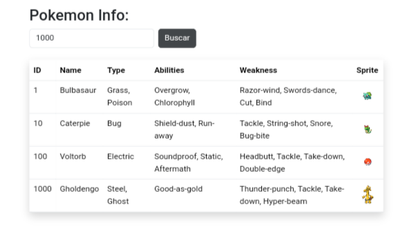

# Pokémon Info  

  

A simple project to fetch Pokémon details using **PokéAPI**.  

## How to Use  

- **[Access here](https://yeytaken.github.io/pokemon-web-api/)** and search for a Pokémon by name or ID.  
- If already listed, the row will flash green to indicate a duplicate.  

## Technologies  

- **HTML, CSS (Bootstrap)**  
- **JavaScript (Fetch API)**  
- **PokéAPI**
